# PES-VCS — Lab Report

**Student Name:** Chiranth.R  
**Student SRN:** PES1UG24AM354  
**Course:** Operating Systems  
**Assignment:** Building a Version Control System from Scratch  
**Platform:** Ubuntu 22.04

---

## Overview

PES-VCS is a local version control system implemented in C that tracks file changes, stores snapshots efficiently using content-addressable storage, and supports a full commit history. The design mirrors Git's internal architecture: every piece of data (files, directories, commits) is stored as an object named by its SHA-256 hash.

### Commands Implemented

| Command | Description |
|---|---|
| `pes init` | Initialise `.pes/` repository structure |
| `pes add <file>...` | Stage files: hash contents, store blob, update index |
| `pes status` | Show staged, modified, and untracked files |
| `pes commit -m <msg>` | Snapshot staged files into a commit object |
| `pes log` | Walk and display full commit history |

---

## Phase 1 — Object Storage Foundation

**Files:** `object.c`  
**Concepts:** Content-addressable storage, SHA-256 hashing, atomic writes, directory sharding

### What Was Implemented

**`object_write`**
1. Builds the full object in memory: `"<type> <size>\0<data>"`
2. Computes SHA-256 of the complete object (header + data)
3. Short-circuits if the object already exists (deduplication)
4. Creates the shard directory `.pes/objects/XX/` where `XX` is the first two hex chars of the hash
5. Writes to a temp file, calls `fsync()`, then `rename()` atomically to the final path
6. `fsync()`s the shard directory to persist the directory entry

**`object_read`**
1. Derives the file path from the hash using `object_path()`
2. Reads the entire file into memory
3. Recomputes SHA-256 and compares against the requested hash — returns `-1` on mismatch (integrity check)
4. Parses the type string from the header, finds the `\0` separator
5. Returns a heap-allocated copy of the data portion to the caller

### Screenshot 1A — Phase 1 Unit Tests Passing

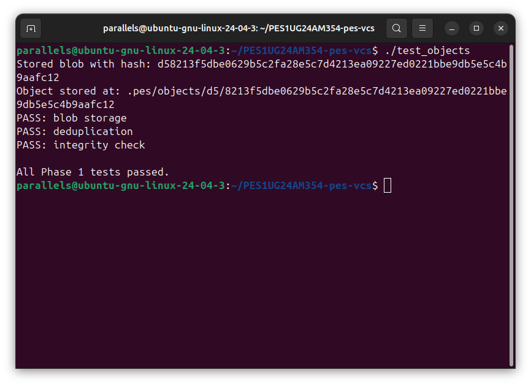

`./test_objects` passes all three tests: blob storage (write and read back), deduplication (same content produces the same hash and is not stored twice), and integrity checking (detects a corrupted object by hash mismatch).

### Screenshot 1B — Sharded Object Store on Disk

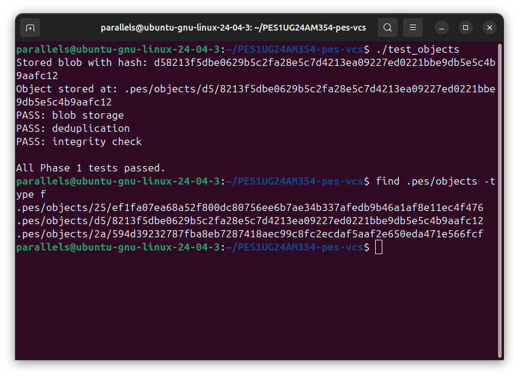

`find .pes/objects -type f` shows three objects created by the test, each stored under a two-character hex shard directory (e.g., `.pes/objects/d5/...`, `.pes/objects/25/...`). This sharding prevents any single directory from growing too large.

---

## Phase 2 — Tree Objects

**Files:** `tree.c`  
**Concepts:** Directory representation, recursive data structures, binary serialisation, file modes

### What Was Implemented

**`tree_from_index`**

A recursive helper `write_tree_recursive(entries, count, prefix, id_out)` walks the sorted index:
- Entries with no `/` after the prefix are files at the current level — added directly as blob entries.
- Entries with a `/` belong to a subdirectory — the subdirectory name is extracted, all entries sharing that prefix are collected, and the function recurses to build and write the subtree first.
- After processing all entries at a level, `tree_serialize()` converts the `Tree` struct to binary format and `object_write(OBJ_TREE, ...)` stores it.

The binary format per entry is: `"<mode-octal> <name>\0"` followed by 32 raw bytes of SHA-256 hash.

### Screenshot 2A — Phase 2 Unit Tests Passing

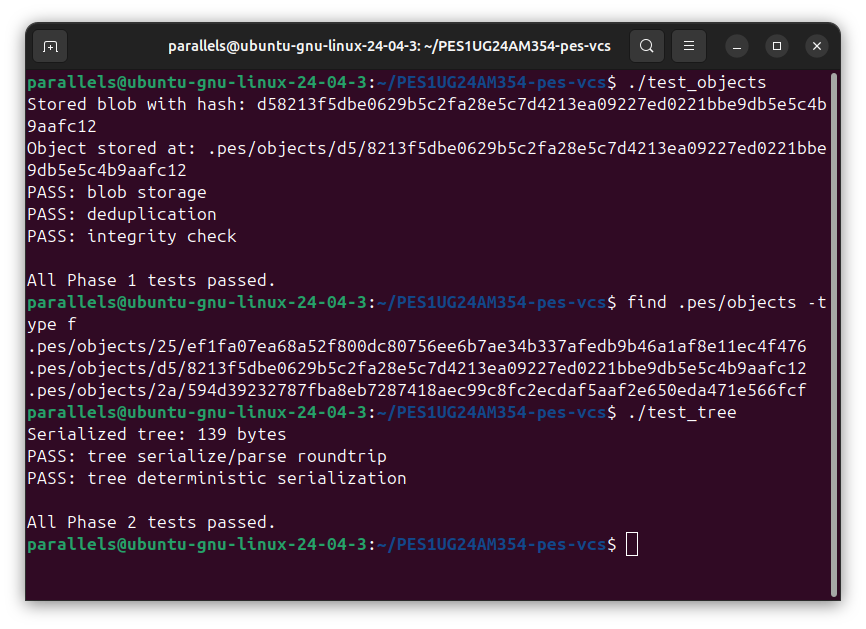

`./test_tree` passes both tests: the serialize→parse roundtrip preserves all entries, modes, and hashes; and deterministic serialisation confirms that the same entries given in any order always produce byte-identical output (because entries are sorted by name before serialisation).

### Screenshot 2B — Raw Tree Object in Hex

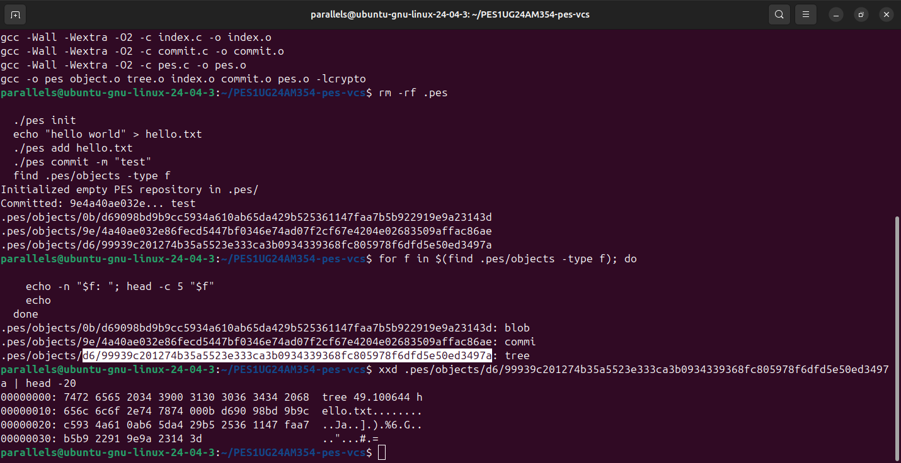

`xxd` on a tree object from the store shows the raw binary format: each entry begins with its octal mode as ASCII text (e.g., `100644`), followed by a space, the filename as a null-terminated string, and then 32 bytes of raw binary SHA-256 hash — not hex-encoded, just raw bytes.

---

## Phase 3 — The Index (Staging Area)

**Files:** `index.c`  
**Concepts:** Text file format design, atomic writes with `fsync`+`rename`, fast change detection via metadata

### What Was Implemented

**`index_load`**
- Opens `.pes/index`; if the file does not exist, silently initialises an empty index (not an error — means nothing has been staged yet).
- Parses each line with `fscanf`: `<mode-octal> <64-hex-hash> <mtime> <size> <path>`.

**`index_save`**
- Copies the index into a local struct and sorts entries by path using `qsort` (ensures deterministic, human-readable output).
- Writes to `.pes/index.tmp`, calls `fflush` + `fsync` to flush all buffers to disk, then `rename()` atomically replaces the live index file. This guarantees the index is never partially written.

**`index_add`**
- Reads the file into a heap buffer, calls `object_write(OBJ_BLOB, ...)` to store its contents.
- Calls `lstat()` to capture `mtime` and `size` for fast dirty detection later.
- Calls `index_find()` to update an existing entry or appends a new one, then calls `index_save()`.

### Screenshot 3A — init → add → status Sequence

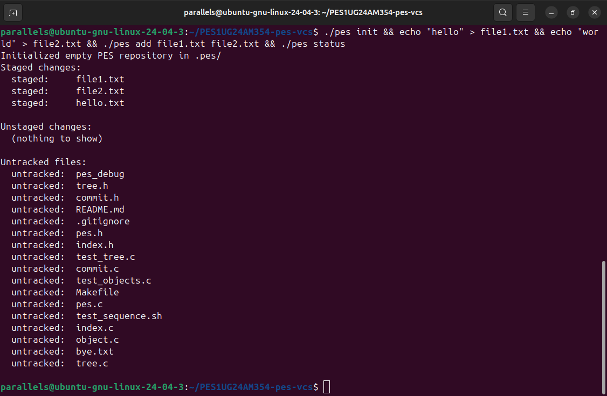

`./pes init` creates the `.pes/` repository, `./pes add file1.txt file2.txt` stages both files (hashing each and storing blobs), and `./pes status` correctly shows them under "Staged changes" with no unstaged or untracked entries.

### Screenshot 3B — Index File Contents

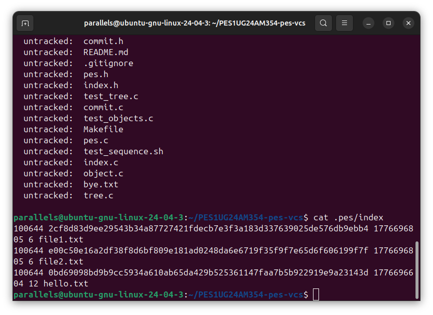

`cat .pes/index` shows the text-format staging area: each line records the octal mode (`100644`), the 64-character hex blob hash, the mtime (Unix timestamp in seconds), the file size in bytes, and the relative path. Entries are sorted alphabetically by path.

---

## Phase 4 — Commits and History

**Files:** `commit.c`  
**Concepts:** Linked on-disk structures, reference files, atomic pointer updates, the parent-chain history model

### What Was Implemented

**`commit_create`**
1. Calls `tree_from_index()` to recursively build and store the entire directory snapshot as tree objects, obtaining the root tree hash.
2. Calls `head_read()` to get the parent commit hash; if it fails (first commit), `has_parent` is set to 0.
3. Reads the author string from the `PES_AUTHOR` environment variable via `pes_author()`.
4. Gets the current Unix timestamp with `time(NULL)`.
5. Calls `commit_serialize()` to produce the text-format commit object, then `object_write(OBJ_COMMIT, ...)` to store it.
6. Calls `head_update()` to atomically move the branch pointer to the new commit hash using temp-file+rename.

### Screenshot 4A — `pes log` with Three Commits

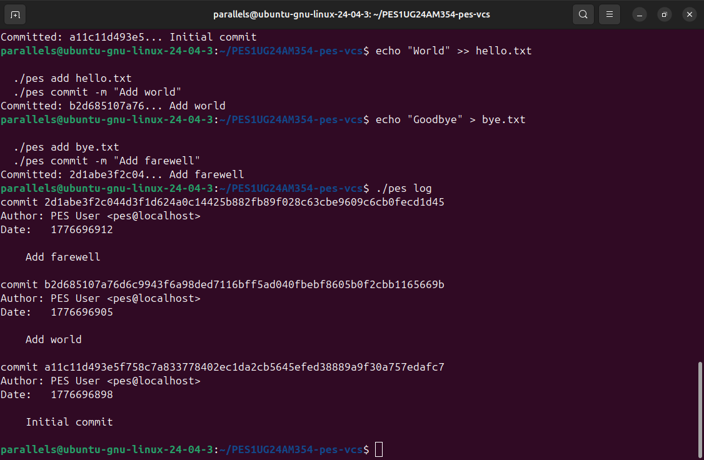

`./pes log` walks the parent chain from HEAD back to the root commit, printing the full 64-character commit hash, author, Unix timestamp, and message for each of the three commits: "Initial commit", "Add world", and "Add farewell".

### Screenshot 4B — Object Store Growth After Three Commits

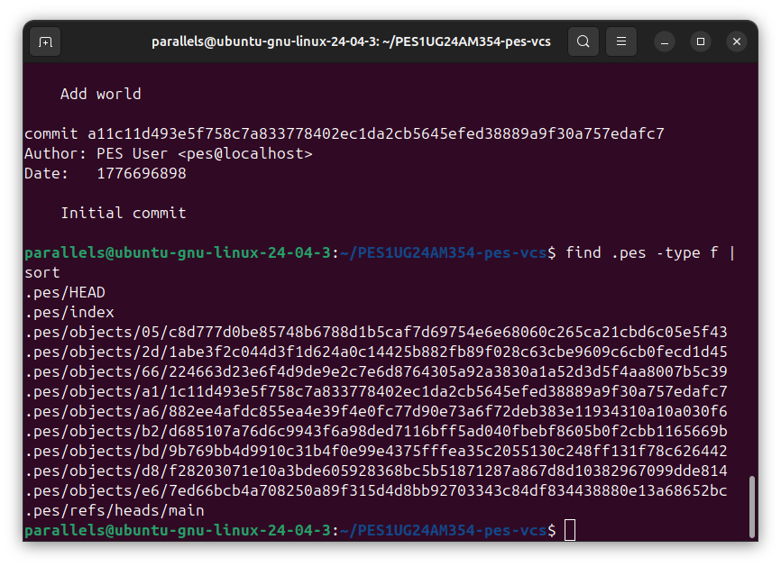

`find .pes -type f | sort` lists all files in the repository after three commits: the `HEAD` file, the `index`, the `refs/heads/main` branch pointer, and 10 objects in the store (3 commits + 3 root trees + blobs for each file version). Unchanged files share blobs across commits.

### Screenshot 4C — Reference Chain

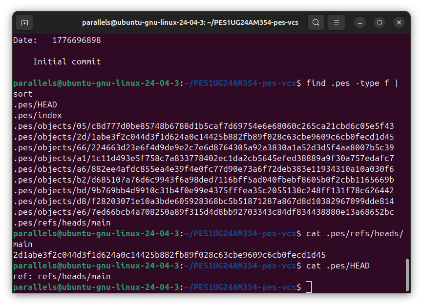

`cat .pes/refs/heads/main` outputs the SHA-256 hash of the latest commit; `cat .pes/HEAD` outputs `ref: refs/heads/main`, confirming the symbolic reference chain: HEAD → branch file → commit hash.

---

## Final — Full Integration Test

### Screenshot Final-1 — Integration Test Start

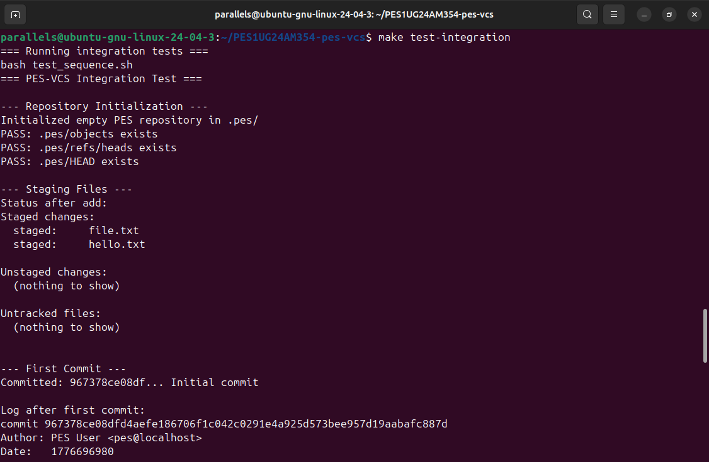

`make test-integration` runs `test_sequence.sh`, which initialises a fresh repository and verifies that `.pes/objects`, `.pes/refs/heads`, and `.pes/HEAD` are all created correctly. It then stages two files and confirms the status output shows both as staged with nothing unstaged or untracked.

### Screenshot Final-2 — Integration Test History

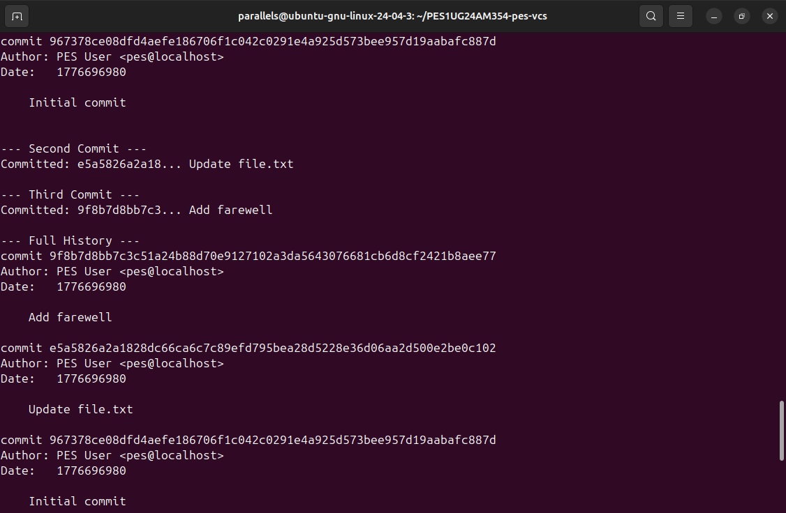

The script creates three commits (Initial, Update, Add farewell) and verifies `pes log` outputs the full history in reverse chronological order with correct hashes, authors, timestamps, and messages for all three commits.

### Screenshot Final-3 — Integration Test Completion

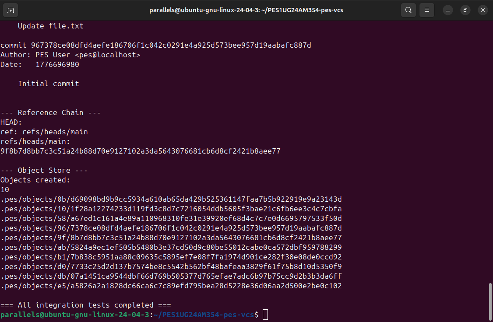

The final section verifies the reference chain (`HEAD` → `refs/heads/main` → latest commit hash), confirms exactly 10 objects were created in the object store, lists all sharded object paths, and prints `=== All integration tests completed ===`.

---

## Phase 5 — Analysis: Branching and Checkout

### Q5.1 — Implementing `pes checkout <branch>`

**Files that must change in `.pes/`:**
- **`.pes/HEAD`** — rewritten to `ref: refs/heads/<branch>` (or directly to a commit hash for detached HEAD).
- **`.pes/refs/heads/<branch>`** — must exist already (switching) or be created pointing at the current commit (new branch).
- **`.pes/index`** — must be replaced with the index reconstructed from the target branch's tree, so that the staged state matches the new HEAD.

**What must happen to the working directory:**
1. Read the target branch's latest commit, follow its tree pointer.
2. Read the current HEAD's tree.
3. Diff the two trees recursively to find: files to create (present in target, absent now), files to delete (present now, absent in target), and files to overwrite (same path, different blob hash).
4. Perform those filesystem operations.

**What makes it complex:**
- **Dirty-file detection:** must refuse to overwrite locally modified files (see Q5.2).
- **Recursive subdirectory handling:** nested trees must be walked in parallel.
- **Atomicity:** if the operation fails partway through, the working directory is in an inconsistent mixed state. Git solves this by checking for conflicts *before* touching any files.
- **Untracked files:** a file in the working directory that is not in the current index but would be overwritten by the target tree must also block the checkout.

---

### Q5.2 — Detecting a Dirty Working Directory Conflict

To decide whether a checkout would unsafely overwrite a file, only the index and the object store are needed:

1. **Is the file locally modified?** For each entry in the current index, `lstat()` the file and compare its `mtime` and `size` against the stored index metadata. A mismatch means the file has changed on disk since it was last staged — it is *dirty*.

2. **Does the file differ between branches?** Look up the same path in the target branch's tree (read from the target commit's root tree object). If the blob hash in the target tree differs from the blob hash in the current index entry, the two branches have different content for this file.

3. **Conflict condition:** if both (1) and (2) are true for the same file, checkout must refuse. The file has local edits *and* the target branch wants to replace it with different content — overwriting would silently discard the user's work.

If only (2) is true (file matches the index, branches differ), the file can be safely updated — the local version is identical to what the current branch committed, so no work is lost. If only (1) is true (locally modified, but the same content on both branches), there is no conflict and the file can be left untouched.

---

### Q5.3 — Detached HEAD and Recovery

**What happens when committing in detached HEAD state:**

When `HEAD` contains a raw commit hash instead of `ref: refs/heads/<branch>`, new commits are still created normally. `commit_create` calls `head_read` (which reads the hash directly from `HEAD`) to set the parent, then `head_update` writes the new commit hash back into `HEAD`. A chain of commits is built. However, **no branch ref points to them** — they are reachable only through `HEAD` itself.

The moment the user runs `pes checkout main` (or any other command that rewrites `HEAD` to a branch ref), the detached commit chain becomes unreferenced. No branch file tracks those hashes, so they are invisible to `pes log` and will be deleted by the next garbage collection run.

**Recovery options:**
- **If the hash was noted:** write the lost hash into a new branch file: `echo <hash> > .pes/refs/heads/recovery`, then update `HEAD` to point to it: `echo "ref: refs/heads/recovery" > .pes/HEAD`.
- **Via a reflog:** Git logs every HEAD movement in `.git/logs/HEAD`. PES-VCS does not implement a reflog, but adding one would make recovery trivial — scan the log for the last known detached commit hash.
- **Via the grace period:** Git's GC does not delete objects newer than 2 weeks (default). The raw object file still exists in `.pes/objects/` and can be found by `find .pes/objects -type f -newer .pes/HEAD` if the user acts quickly.

---

## Phase 6 — Analysis: Garbage Collection

### Q6.1 — Finding and Deleting Unreachable Objects

**Algorithm (mark-and-sweep):**

**Mark phase — collect all reachable hashes:**
1. Seed the frontier with every hash found in `.pes/refs/heads/*` and `HEAD` (if detached).
2. For each commit hash in the frontier: add it to the reachable set; read the commit object; add its tree hash to the frontier; if it has a parent, add the parent hash.
3. For each tree hash: add it; read the tree object; for each entry, add its hash (recurse if the entry is a subtree, otherwise it is a blob).
4. Repeat until the frontier is empty.

**Data structure:** A **hash set** (open-addressing hash table keyed on the 32-byte SHA-256) provides O(1) insert and lookup. Since all keys are already uniformly distributed random bytes, no additional hashing is needed.

**Sweep phase:**
Walk every file under `.pes/objects/` (reconstructing the 64-hex hash from the 2-char shard directory name + 62-char filename). Any object whose hash is absent from the reachable set is deleted.

**Estimate for 100,000 commits, 50 branches:**
- Assume an average project snapshot contains 50 objects per commit (1 commit + ~5 directory trees + ~44 blobs).
- Total objects to mark: 100,000 × 50 = **~5,000,000 objects**.
- Hash set memory: 5,000,000 entries × ~40 bytes (32-byte key + pointer/metadata) ≈ **~200 MB**.
- All 5 million objects must be read once in the mark phase and walked once in the sweep phase.

---

### Q6.2 — GC Race Condition with Concurrent Commits

**The race condition:**

Consider two concurrent operations — a `pes commit` and a `pes gc`:

1. The commit writes a new blob object **B** to the object store. At this point B exists on disk but is not yet referenced by any tree or commit object.
2. GC's **mark phase** runs. It traverses all reachable commits and trees. B is not referenced by any reachable object yet, so it is **not marked as reachable**.
3. GC's **sweep phase** runs and **deletes B** (unreachable, fair game).
4. The commit now writes tree object **T** that references B, then commit **C** that references T, then updates HEAD to C.
5. The repository is now corrupt: C → T → B, but B no longer exists on disk. Any future read of B will fail.

**How Git avoids this:**

- **Grace period (`gc.pruneExpire`, default 2 weeks):** Git's `git prune` refuses to delete any object whose file modification time is less than 2 weeks old. A newly written blob is always younger than 2 weeks, so GC will never delete it even if it hasn't been referenced yet. The commit operation only needs to complete within 2 weeks of writing the blob, which is always true.
- **Write ordering:** Git always writes objects *before* writing any reference to them (blob before tree, tree before commit, commit before branch ref update). GC starts from refs and walks forward; an object that was written before any ref points to it will be picked up on the next GC run once the ref chain is complete.
- **Lock files (`.lock`):** Pack operations and ref updates use lock files so GC can detect and yield to concurrent writers.
- **`--recent-object-file` / loose object grace:** The combination of ordering guarantees and the grace period means that no in-progress commit's objects are ever at risk of deletion.

---

## Submission Checklist

| Phase | ID | Status |
|---|---|---|
| 1 | 1A — `./test_objects` all passing | ✅ |
| 1 | 1B — sharded object store structure | ✅ |
| 2 | 2A — `./test_tree` all passing | ✅ |
| 2 | 2B — raw tree object hex dump | ✅ |
| 3 | 3A — init → add → status | ✅ |
| 3 | 3B — `.pes/index` contents | ✅ |
| 4 | 4A — `pes log` three commits | ✅ |
| 4 | 4B — object store after three commits | ✅ |
| 4 | 4C — HEAD and refs/heads/main | ✅ |
| Final | Full integration test | ✅ |
| 5 | Q5.1, Q5.2, Q5.3 — Branching analysis | ✅ |
| 6 | Q6.1, Q6.2 — GC analysis | ✅ |
